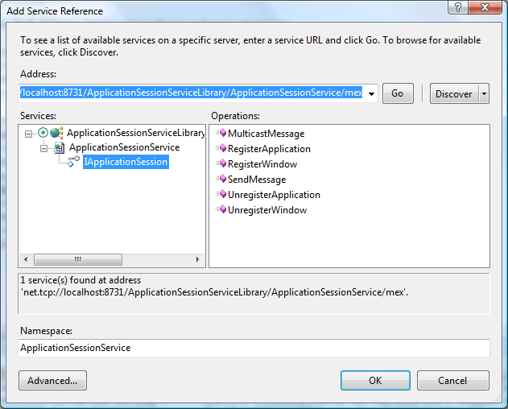
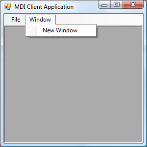
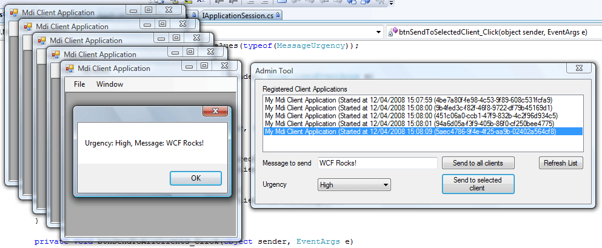

# A Combination of WCF Essentials

## Introduction

This week at work a [colleague](http://www.scip.be) and I had the chance to play around with the Windows Communication Foundation (WCF). We had to create a service which is capable of registering every client and each opened window in said clients. The client application is nothing more than a regular MDI application.

The goal was to provide our customers with an admin tool so that they can view which clients are currently connected and which windows are opened within them. The admin tool allows the users to communicate with the connected clients through the use of callbacks. Enabling them to do various cool stuff such as sending a message to all clients or just one in particular, closing a window or just forcing all clients applications to shut down...etc.

This was a challenging and fun task to complete. In this article I'll present a trimmed down version of the service. I'll take you through the steps we had to discover for ourselves in order to be able to create the service.

Let's get started...

## The Service

The service itself offers the following functionality:

1. Registering a client application
2. Unregistering a client application
3. Registering a window
4. Unregistering a window
5. Sending a message to all the clients or one particular client
6. Retrieving a list of all the connected client applications

Basically you need to maintain a collection of all connected clients and their active windows. Apart from this you'll need to implement a callback mechanism that will allow the service to communicate with each client or just one particular client of your choosing. A callback will be implemented for each client application, not for each opened window.

The service enables each client application to send messages to all the other clients or just one client in particular. However the only client endowed with this ability is the admin tool, the regular clients just handle the received messages.

All applications and windows will be be uniquely identifiable by assigning a [GUID](http://en.wikipedia.org/wiki/Guid) to them. All the service needs to do is to maintain two dictionaries. One that contains all the application guid's and a reference to their callback channel and another dictionary that maintains all the active windows for each application. Listing 1 lists the needed fields to maintain this state.

**Listing 1** - Service Type Instance Fields

```csharp
Dictionary<Guid, ICallbackContract> clients;
Dictionary<Guid, Guid> windows;
```

Don't worry about the details just yet, it will become clear in the following sections.

## The Number of Service Instances

You'll get to the nitty gritty details of the implementation in a bit, but before you start designing the service their is one important question that needs to be answered first. Namely, how will the service be instantiated?

You can control the way a new instance of your service type is created by applying the [ServiceBehavior](http://msdn2.microsoft.com/en-us/library/system.servicemodel.servicebehaviorattribute.aspx) attribute to the service type and setting its [InstanceContextMode](http://msdn2.microsoft.com/en-us/library/system.servicemodel.instancecontextmode.aspx) property to the desired value. To specify the number of service instances available for handling incoming calls you can choose one of the following values:

- **PerSession**: A private session between a client and a particular service instance is maintained by the WCF. You get a new dedicated service instance for each proxy that connects to a session-aware service. The private session links your proxy to a particular service instance.
- **PerCall**: A new service instance is created for each call made to the service. For each call a new full-blown service instance will be instantiated.
- **Single**: The service is a singleton. Its lifetime is connected to that of the host. It is created once when the host is created and is disposed of when the host shuts down. Every incoming call to that service during the lifetime of the host will be dispatched to the same single service instance no matter who calls it.

Remark: In order to use sessions the binding you choose has to support it. Choosing the correct binding not only offers support for sessions, but also makes sure your messages are delivered in the correct order. So when you send three messages A, B and C you will receive them in that order and not B first, then C and finally A.

Which InstanceContextMode fits the bill for this service?

- **PerSession:** You can opt for a dedicated service instance for each client. Though this allows you to maintain state in memory between service calls, scalability can be an issue if you have a couple hundred client applications running due to the cost of instantiating a new service instance for each client.
- **PerCall**: Just as the PerSession mode, a PerCall service suffers from scalability issues if you make a lot of calls to the service because each time a new service instance will be created prior to the execution of the called method and disposed afterwards. The benifit compared to a PerSession service is that when you're not making any calls to the service it doesn't have to keep any objects alive. On the client side you have a proxy which maintains a reference to the object on the other end of the wire, but there actually isn't one. This frees up resources but ofcourse you can't maintain state between calls, unless you resort to some way of preserving the state such as static variables, rehydrating / hydrating the object with each call from a persistent storage medium such as a database...etc.
- **Single**: A single service instance no matter how many clients call the service might seem like an interesting option since it won't use up many resources. The drawback however is that you can have multiple calls from multiple clients at the same time. All those calls will be handled by the same service instance. If you only allow one single thread to access the service instance this will drastically reduce the performance. To speed things up you quickly wind up dealing with multiple threads and the obligatory synchronisation that ensues.

No matter which option you choose for this service, the two dictionaries mentioned in the previous section must be shared accross all service instances. Each service instance should known which client applications are connected to it so that it can callback into these clients. You could save this information in a database or any other persistent storage medium and retrieve it for each service instance, but to keep this demo simple and short a more volatile storage medium such as static variables suffices.

Actually you might have 200, 300 connected clients at a single moment in time. Do you want to deal with 300 service instances that are kept alive? I guess not, so the PerSession option is out of the door. The same goes for a PerCall service. Although there will only be as many service instances as there are calls at the same time, this can still be quite a strain. These two options also introduce a race condition because each service instance can access the same shared resources. It is your responsibility to guard this state with locks so that it doesn't become corrupted.

The only remaining option is to develop the service as a singleton. Only one service instance will exists from now till the end of times or till the host shuts down, whichever one comes first. So making the dictionaries static serves no purpose, you can just declare them as instance fields. Only one service instance will ever be created.

## Concurrency

The problem of having multiple service instances dissapears if you opt for a Singleton service. The race condition also vanishes because there is only one single service instance and by default a service instance can be accessed only by one thread at a time. This guarantees that your state will remain consistent. However because you are dealing with multiple clients which interact with this service instance this can slow down performance as each call has to wait for its turn. For this reason the race condition will be reintroduced by allowing multiple threads to access the service instance.

This is where another facet of designing WCF services comes into play. The [ConcurrencyMode](http://msdn2.microsoft.com/en-us/library/system.servicemodel.concurrencymode.aspx) property of the ServiceBehavior attribute specifies whether a service instance supports single-threaded or multi-threaded access. You can choose one of the following values:

- **Single**: Only one thread can access the service instance at a time.
- **Multiple**: Multiple threads may access the service instance concurrently.
- **Reentrant**: Only one thread can access the service instance at a time, but the service can call another service which in its turn can reenter the calling service instance via a callback.

Setting the ConcurrencyMode to Multiple will speed things up by allowing multiple threads to access the service instance. This introduces a race condition that can lead to concurrent access of the instance fields. You have to keep the state of the service instance consistent by using locks.

## Service Contract

The C part of this WCF service's ABC is very simple to implement. To get things started create a brand-new blank solution and call it WCFEssentials. Next add a new project named ApplicationSessionServiceLibrary to the solution using the WCF Service Library project template.

The project template provides you with two files IService1.cs and Service.cs out of the box. As the name indicates the IService1.cs file contains the interface or service contract which will be exposed through the service's endpoint(s). The contract indicates which functionality the service supports.

Rename the IService1.cs file to IApplicationSession.cs and delete all of the boilerplate code. Next add the code shown in Listing 2.

**Listing 2** - IApplicationSession.cs File

```csharp
using System;
using System.ServiceModel;

namespace CGeers.Wcf.Server.ApplicationSessionServiceLibrary
{
    // The Namespace property is provided for illustrative purposes
    [ServiceContract(Namespace = "cgeers.wordpress.com",
        CallbackContract = typeof(IApplicationSessionCallback))]
    public interface IApplicationSession
    {
        [OperationContract(IsOneWay = true)]
        void RegisterApplication(Guid applicationId, String petName);
        [OperationContract(IsOneWay = true)]
        void UnregisterApplication(Guid applicationId);
        [OperationContract(IsOneWay = true)]
        void RegisterWindow(Guid windowId, Guid applicationId);
        [OperationContract(IsOneWay = true)]
        void UnregisterWindow(Guid windowId);
        // The following two methods are required by the admin tool.
        [OperationContract]
        ClientApplication[] RegisteredClients();
        [OperationContract(IsOneWay = true)]
        void MulticastMessage(Guid applicationId, MessageUrgency urgency, string message);
    }
}
```

The interface is adorned with the [ServiceContract](http://msdn2.microsoft.com/en-us/library/system.servicemodel.servicecontractattribute.aspx) attribute indicating that it defines the service contract for this WCF service. Two properties of this attribute, namely Namespace and CallbackContract are also supplied.

The Namespace attribute is only important if your service exposes custom types, it maps to the namespace of the contract in the resulting WSDL that will be generated. This way your custom types fall into their own namespace and any future ambiguity will hopefully be avoided. In this example it is only provided for illustrative purposes. Later on in this article complex types will be added.

The [CallbackContract](http://msdn2.microsoft.com/en-us/library/system.servicemodel.servicecontractattribute.callbackcontract.aspx) property allows you to define a contract which the WCF service uses to callback into the caller. You only need this for two-way (duplex) communication. Since this service needs to be able to send messages to one or more client applications you'll need it. Don't fret over it now, it will be covered in one of the following sections.

Each method in this interface is adorned with the [OperationContract](http://msdn2.microsoft.com/en-us/library/system.servicemodel.operationcontractattribute.aspx) attribute to indicate that it is part of the service contract. Furthermore the [IsOneWay](http://msdn2.microsoft.com/en-us/library/system.servicemodel.operationcontractattribute.isoneway.aspx) property of this attribute is set to true for all methods except one. By doing this you are in fact creating fire-and-forget calls meaning that the caller does not have to wait for a reply. WCF differentiates between the following invocation models:

1. **Request-Reply Operations (Default)**: The caller waits for a reply
2. **One-Way Operations (Fire-and-forget)**: The caller does not wait for a reply
3. **Duplex Callbacks (Two-way communication)**: The service is allowed to call back into its caller.

By using one-way operations for this service, the client applications are sped up because they don't have to wait until the service instance has processed the call. For this simple demo we don't care if the invocation succeeds or fails.

## Service Type

Now that the contract is in place you have to provide an implementation. Rename the Service1.cs file to ApplicationSessionService.cs.cs and delete the generated boilerplate code as well. Listing 3 lists the code for the service type, it is discussed afterwards.

**Listing 3** - ApplicationSessionService.cs File

```csharp
using System;
using System.Collections.Generic;
using System.Linq;
using System.ServiceModel;
using System.Runtime.Serialization;

namespace CGeers.Wcf.Server.ApplicationSessionServiceLibrary
{
    [DataContract]
    public class ClientApplication
    {
        [DataMember]
        public Guid Id { get; set; }
        [DataMember]
        public string PetName { get; set; }
    }

    [ServiceBehavior(InstanceContextMode = InstanceContextMode.Single,
        ConcurrencyMode = ConcurrencyMode.Multiple)]
    public class ApplicationSessionService : IApplicationSession
    {
        #region Instance fields

        // The thisLock object is used to protect critical sections
        // of code. This ensures that only one thread at a time can
        // enter a critical section of code. Other threads trying to
        // enter this critical section will have to wait until the
        // object is released.
        private static object thisLock = new object();

        // This dictionary maintains a collection of the connected client applications.
        private Dictionary<ClientApplication, IApplicationSessionCallback> clients =
            new Dictionary<ClientApplication, IApplicationSessionCallback>();

        // This dictionary maintains a collection of opened windows for each client
        // application.
        private Dictionary<Guid, Guid> windows =
            new Dictionary<Guid, Guid>();

        #endregion

        #region IApplicationSession Members

        public void RegisterApplication(Guid applicationId, string petName)
        {
            IApplicationSessionCallback callback =
                OperationContext.Current.GetCallbackChannel<IApplicationSessionCallback>();
            lock (thisLock)
            {
                clients.Add(new ClientApplication { Id = applicationId, PetName = petName }, callback);
            }
        }

        public void UnregisterApplication(Guid applicationId)
        {
            // Use a simple LINQ to Objects query to extract the element(s)
            // we want to delete from the clients & windows dictionary.
            lock (thisLock)
            {
                // Remove all the windows belonging to the application.
                Action<Guid> action =
                    delegate(Guid windowId)
                    {
                        windows.Remove(windowId);
                    };
                List<Guid> windowsList =
                    (from w in windows
                     where w.Value == applicationId
                     select w.Key).ToList();
                windowsList.ForEach(action);

                // Remove the application itself.
                var aQuery = from c in clients.Keys
                             where c.Id == applicationId
                             select c;
                clients.Remove(aQuery.First());
            }
        }

        public void RegisterWindow(Guid windowId, Guid applicationId)
        {
            lock (thisLock)
            {
                windows.Add(windowId, applicationId);
            }
        }

        public void UnregisterWindow(Guid windowId)
        {
            lock (thisLock)
            {
                windows.Remove(windowId);
            }
        }

        public void MulticastMessage(Guid applicationId, MessageUrgency urgency, string message)
        {
            List<IApplicationSessionCallback> query = null;
            if (applicationId != Guid.Empty)
            {
                query = (from c in clients
                         where c.Key.Id == applicationId
                         select c.Value).ToList();
            }
            else
            {
                query = (from c in clients select c.Value).ToList();
            }

            Action<IApplicationSessionCallback> action =
                delegate(IApplicationSessionCallback callback)
                {
                    callback.MessageReceived(urgency, message);
                };

            query.ForEach(action);
        }

        public ClientApplication[] RegisteredClients()
        {
            return clients.Keys.ToArray<ClientApplication>();
        }

        #endregion
    }
}
```

The ApplicationSessionService class implements the IApplicationSession interface thus providing an implementation for the service. By decorating the class with the ServiceBehaviour attribute and setting its InstanceContextMode and ConcurrencyMode properties to the correct values as dicussed earlier this effectively tells WCF that it should only create one single instance of the service type and that multiple threads may access it.

The race condition introduced by using ConcurrencyMode.Multiple is taken care of by locking critical sections of code. This way the state of the singleton service instance is protected and will not be corrupted by concurrent access by multiple threads. This is done by applying a mutual exclusive lock on the thisLock object by using the [lock statement](<http://msdn2.microsoft.com/en-us/library/c5kehkcz(VS.71).aspx>).

In this example there isn't much code in the service type so pretty much everything winds up in a lock. So you don't gain much by allowing multiple threads to access the singleton service instance. But for this demo this should suffice. Take a look a [Justin Smith](http://www.wintellect.com/cs/blogs/jsmith/archive/2006/05/16/instancecontextmode-and-concurrencymode.aspx)'s blog if you're interested in learning more about combining different InstanceContextMode and ConcurrencyMode modes and their effects on WCF services.

He provides a handy table which indicates when synchronization is necessary.

**Listing 4** - InstanceContextMode & ConcurrencyMode Combinations

<table class="MsoTableGrid" style="border:medium none;border-collapse:collapse;" border="0" cellspacing="0" cellpadding="0"><tbody><tr><td style="width:115.15pt;padding:0 5.4pt;" rowspan="2" width="154"><p class="MsoNormal" style="margin-bottom:0.0001pt;text-align:center;line-height:normal;" align="center"><strong>InstanceContextMode</strong></p></td><td style="width:345.45pt;padding:0 5.4pt;" colspan="3" width="461" valign="top"><p class="MsoNormal" style="margin-bottom:0.0001pt;text-align:center;line-height:normal;" align="center"><strong>ConcurrencyMode</strong></p></td></tr><tr><td style="width:115.15pt;padding:0 5.4pt;" width="154" valign="top"><p class="MsoNormal" style="margin-bottom:0.0001pt;line-height:normal;"><strong>Single</strong></p></td><td style="width:115.15pt;padding:0 5.4pt;" width="154" valign="top"><p class="MsoNormal" style="margin-bottom:0.0001pt;line-height:normal;"><strong>Multiple</strong></p></td><td style="width:115.15pt;padding:0 5.4pt;" width="154" valign="top"><p class="MsoNormal" style="margin-bottom:0.0001pt;line-height:normal;"><strong>Reentrant</strong></p></td></tr><tr><td style="width:115.15pt;padding:0 5.4pt;" width="154" valign="top"><p class="MsoNormal" style="margin-bottom:0.0001pt;line-height:normal;"><strong>Single</strong></p></td><td style="width:115.15pt;padding:0 5.4pt;" width="154" valign="top"><p class="MsoNormal" style="margin-bottom:0.0001pt;line-height:normal;">No</p></td><td style="width:115.15pt;padding:0 5.4pt;" width="154" valign="top"><p class="MsoNormal" style="margin-bottom:0.0001pt;line-height:normal;">Yes</p></td><td style="width:115.15pt;padding:0 5.4pt;" width="154" valign="top"><p class="MsoNormal" style="margin-bottom:0.0001pt;line-height:normal;">Yes</p></td></tr><tr style="height:4pt;"><td style="width:115.15pt;height:4pt;padding:0 5.4pt;" width="154" valign="top"><p class="MsoNormal" style="margin-bottom:0.0001pt;line-height:normal;"><strong>PerSession</strong></p></td><td style="width:115.15pt;height:4pt;padding:0 5.4pt;" width="154" valign="top"><p class="MsoNormal" style="margin-bottom:0.0001pt;line-height:normal;">No</p></td><td style="width:115.15pt;height:4pt;padding:0 5.4pt;" width="154" valign="top"><p class="MsoNormal" style="margin-bottom:0.0001pt;line-height:normal;">Yes</p></td><td style="width:115.15pt;height:4pt;padding:0 5.4pt;" width="154" valign="top"><p class="MsoNormal" style="margin-bottom:0.0001pt;line-height:normal;">Yes</p></td></tr><tr><td style="width:115.15pt;padding:0 5.4pt;" width="154" valign="top"><p class="MsoNormal" style="margin-bottom:0.0001pt;line-height:normal;"><strong>PerCall</strong></p></td><td style="width:115.15pt;padding:0 5.4pt;" width="154" valign="top"><p class="MsoNormal" style="margin-bottom:0.0001pt;line-height:normal;">No</p></td><td style="width:115.15pt;padding:0 5.4pt;" width="154" valign="top"><p class="MsoNormal" style="margin-bottom:0.0001pt;line-height:normal;">No</p></td><td style="width:115.15pt;padding:0 5.4pt;" width="154" valign="top"><p class="MsoNormal" style="margin-bottom:0.0001pt;line-height:normal;">No</p></td></tr></tbody></table>

Remark: There are exceptions to the above table. For example, if you use static variables on a PerCall service type where the ConcurrencyMode is set to Multiple you'll still need to deal with synchronization.

If you take a look at the code in Listing 3 you'll see that the service type maintains two dictionaries. One that contains all the connected client applications and another one that keeps track of the opened windows per client application.

For the first dictionary a class called ClientApplication is provided as the dictionary's key which is nothing more than a placeholder for some data, namely the application's unique identifier (Guid) and a friendly moniker (PetName). This is just for illustrative purposes so that the admin tool can show a friendly name to the user. You are free to come up with your own implementation. If you take a look at the service contract in the previous section you'll notice that an array of the ClientApplication type is returned by the RegisteredClients() method. The admin tool uses this method to get hold of a list of connected client applications.

Because you renamed the IService1.cs and Service1.cs files you also have to rename all of the IService1 and Service1 occurences in the App.config file. Furthermore for this demo I have choosen TCP as the binding since this supports duplex operations and the default HTTP binding does not. Take a look at the accompagnying source code of this article to see how the service is configured.

## Callback Contract

Before implementing the client side story of this demo there is one more thing that needs to be done regarding the service. It needs to be able to talk to the clients.

If you take a look at the service contract in Listing 2 you'll see that the ServiceContract attribute specifies a callback contract through its [CallbackContract property](http://msdn2.microsoft.com/en-us/library/system.servicemodel.servicecontractattribute.callbackcontract.aspx). This property lets you define a contract which the WCF service uses to callback into the caller, thus allowing two-way (duplex) communication.

The specified interface in the CallbackContract property is named IApplicationSessionCallback. Client applications can listen for inbound calls that the service sends by implementing this interface. Listing 5 shows you the callback contract. It contains one member, namely a method that is marked as a one-way callback method. The service can send a message to one or more client applications without having to wait for a reply.

**Listing 5** - IApplicationSessionCallback.cs File

```csharp
using System.Runtime.Serialization;
using System.ServiceModel;

namespace CGeers.Wcf.Server.ApplicationSessionServiceLibrary
{
    // This enumeration type is included purely for
    // illustrative purposes to showcase the EnumMember
    // attribute.
    [DataContract]
    public enum MessageUrgency
    {
        [EnumMember]
        Low,
        [EnumMember]
        Guarded,
        [EnumMember]
        Elevated,
        [EnumMember]
        High,
        [EnumMember]
        Severe
    }

    public interface IApplicationSessionCallback
    {
        [OperationContract(IsOneWay = true)]
        void MessageReceived(MessageUrgency urgency, string message);
    }
}
```

The one-way callback method MessageReceived(...) has two parameters, the first being an indication of how severe the message is and the latter being the actual message. The first parameter is of the enumerated type MessageUrgency. I have included this parameter purely for illustrative purposes to show that enumerated types not only require the [DataContract attribute](http://msdn2.microsoft.com/en-us/library/system.runtime.serialization.datacontractattribute.aspx) but also the [EnumMember](http://msdn2.microsoft.com/en-us/library/aa347875.aspx) attribute for each member that must be included in the data contract. [Serializing enums in WCF](http://zianet.dk/blog/2007/11/24/serializing-enums-in-wcf/) is a bit different than other complex types.

Members not adorned with this attribute will not be serialized. So in contrast to other types such as structures, classes you must use EnumMember instead of [DataMember](http://msdn2.microsoft.com/en-us/library/system.runtime.serialization.datamemberattribute.aspx). Note that when you have an enum property on a class that is decorated with the DataContract attribute you have to use the DataMember attribute for the enum property. The EnumMember property is only used for members on the enumeration type itself.

## Service Reference

The first order of business for creating the client application is to add a new Class Library project to the solution called ServiceReferences. Delete the default Class1.cs file and right-click on the newly created project and choose Add Service Reference.

In the resulting dialog click on Discover, choose the IApplicationSession service contract and set the namespace to ApplicationSessionService.

[]

In the following sections two client applications are going to be made, namely the MDI client application and the admin tool. To prevent both projects from containing a reference to the same service they will instead reference this class library. If you update the service, you only have to update one service reference instead of two or more. This keeps the generated client-side proxy used to invoke the methods on the service in one location.

## Wrapping The Proxy

The client application and admin tool have another thing in common. They both have to deal with a client-side proxy in order to call methods on the service. Instead of having to deal with this twice it is better to create a wrapper for the proxy and use this new type instead.

For this reason add a new file ClientSessionManager.cs to the ServiceReferences project. In this new file add a class type named ClientSessionManager under a nested namespace, namely ServiceReferences.ProxyManagers. Listing 6 lists the code for this new type, which is discussed afterwards.

**Listing 6** - ClientSessionManager Singleton

```csharp
using System;
using System.ServiceModel;
using ServiceReferences.ApplicationSessionService;

namespace ServiceReferences.ProxyManagers
{
    public class SessionMessageEventArgs : EventArgs
    {
        public MessageUrgency Urgency { get; set; }
        public string Message { get; set; }
    }

    public class ClientSessionManager : IDisposable, IApplicationSessionCallback
    {
        // Expose the proxy.
        public ApplicationSessionClient Proxy { get; set; }

        public event EventHandler<SessionMessageEventArgs> OnMessageReceived;

        #region Singleton Pattern

        // Static members are lazily initialized.
        // .NET guarantees thread safety for static initialization.
        private static readonly ClientSessionManager instance = new ClientSessionManager();

        // Make the constructor private to hide it.
        // This class adheres to the singleton pattern.
        private ClientSessionManager()
        {
            InstanceContext site = new InstanceContext(this);
            Proxy = new ApplicationSessionClient(site);
        }

        // Return the single instance of the ClientSessionManager type.
        public static ClientSessionManager Instance
        {
            get
            {
                return instance;
            }
        }

        #endregion

        #region IDisposable Members

        private bool disposed;

        private void Dispose(bool disposing)
        {
            if (!this.disposed)
            {
                if (disposing)
                {
                    // Clean up any managed resources here.
                    // ...
                }

                // Clean up any unmanged resources here.
                Proxy.Close();

                disposed = true;
            }
        }

        public void Dispose()
        {
            Dispose(true);
            GC.SuppressFinalize(this);
        }

        ~ClientSessionManager()
        {
            Dispose(false);
        }

        #endregion

        #region IApplicationSessionCallback Members

        public void MessageReceived(MessageUrgency urgency, string message)
        {
            // Forward the message to anyone who subscribed to the OnMessageReceived
            // event.
            if (OnMessageReceived != null)
            {
                OnMessageReceived(this,
                    new SessionMessageEventArgs { Urgency = urgency, Message = message });
            }
        }

        #endregion
    }
}
```

If you take a look at the code in Listing 6 you can distil the following essential elements:

- **Disposable**: This type contains a property of the ApplicationSessionClient type which is in fact the proxy type generated in the previous section. The Close method has to be called on any instance created of this type. That's why the [Dispose Pattern](http://www.codeproject.com/KB/dotnet/idisposable.aspx) has been applied here.
- **Callback**: This type also implements the IApplicationSessionCallback interface. If the service calls back into the caller it will be received on an instance of this type. Note that a proxy for a service that specifies a callback contract has to pass an instance of the [InstanceContext type](http://msdn2.microsoft.com/en-us/library/system.servicemodel.instancecontext.aspx) to the constructor of the proxy. This object represents the context information for a service instance.
- **Event Handling**: Any message sent by the service is received in the MessageReceived(...) method. This method then delegates the incoming message to all the event handlers that have subscribed to the event OnMessageReceived(...). This event passes the received message data through a derived EventArgs type called SessionMessageEventArgs. This way you can handle the message where ever you want in the client application and you can subscribe as many event handlers as you want to this event.
- **Singleton**: Only one proxy instance per client application will be maintained. The ClientSessionManager class therefore adheres to the [Singleton Pattern](http://www.dofactory.com/Patterns/PatternSingleton.aspx). This guarantees that only one proxy instance will be created per AppDomain.

In the following sections you'll see how this ClientSessionManager type will be used in the client application and admin tool.

## The Client

The client is a simple MDI application. It contains one main form which serves as the MDI container and one child form which you can open multiple times within the container. Discussing how to build an MDI application is not the purpose of this article, if you need information on how to accomplish this then take a look at this [article](http://www.c-sharpcorner.com/UploadFile/ggaganesh/DevelopingMDIAppplicationsinCSharp11272005225843PM/DevelopingMDIAppplicationsinCSharp.aspx) on the C# Corner. Take a look at the screenshot below to see how I composed my client. Feel free to improve on the design.

[](http://cgeers.files.wordpress.com/2008/04/clientapplication.gif)

The main form contains a menu strip with only one option that matters for the demo. Clicking on the menu item Window | New Window will create a new child window within the MDI container. Take a look at the source code accompagnying this article to see how this client application is constructed.

Once the client has been designed add a reference to the ServiceReferences project created in the previous section. Also add a reference to the System.ServiceModel assembly, this is needed to be able to communicate with the WCF service. Last but not least add an Application Configuration File (App.config) to the project and copy the contents of the App.config file from the ServiceReferences project to it.

The only work that remains it to register the client application and each child window with the service. Listing 7 shows you how to register / unregister the application, while Listing 8 does the same for the child form.

**Listing 7** - Registering The Application

```csharp
using System;
using System.Windows.Forms;
using ServiceReferences.ApplicationSessionService;
using ServiceReferences.ProxyManagers;

namespace MdiClientApplication
{
    public partial class MainForm : Form
    {
        ClientSessionManager sessionManager = ClientSessionManager.Instance;
        public Guid ApplicationId { get; set; }

        public MainForm()
        {
            InitializeComponent();
            ApplicationId = Guid.NewGuid();
            // Subscribe to any incoming messages.
            sessionManager.OnMessageReceived +=
                new EventHandler<SessionMessageEventArgs>(OnMessageReceived);
        }

        private void OnMessageReceived(object sender, SessionMessageEventArgs e)
        {
            MessageBox.Show(String.Format("Urgency: {0}, Message: {1}",
                e.Urgency, e.Message));
        }

        private void MainForm_Load(object sender, EventArgs e)
        {
            sessionManager.Proxy.RegisterApplication(ApplicationId,
                String.Format("My Mdi Client Application (Started at {0}", DateTime.Now));
        }

        private void MainForm_FormClosed(object sender, FormClosedEventArgs e)
        {
            // If you close the application and there are still windows opened
            // they will be unregistered automatically by the UnregisterApplication
            // call.
            sessionManager.Proxy.UnregisterApplication(ApplicationId);
            sessionManager.Dispose();
        }

        private void exitToolStripMenuItem_Click(object sender, EventArgs e)
        {
            Close();
        }

        private void newWindowToolStripMenuItem_Click(object sender, EventArgs e)
        {
            ChildForm.NewForm(this, sessionManager);
        }
    }
}
```

The main form instantiates the ClientSessionManager singleton discussed in the previous section and passes it along to any child form at the moment of creation. When the form is loaded the application is registered with the service and when it's closed its unregistered.

As you can see the form also subscribes to the OnMessageReceived event of the ClientSessionManager singleton. Any messages received from the server will arrive on this singleton and then in the OnMessageReceived(...) event handler located on the main form after the singleton fires the event.

Registering and unregistering child windows with the service is simular to the code of the main form. Listing 8 lists the code for an MDI child form.

**Listing 8** - Registering A Window

```csharp
using System;
using System.Windows.Forms;
using ServiceReferences.ApplicationSessionService;
using ServiceReferences.ProxyManagers;

namespace MdiClientApplication
{
    public partial class ChildForm : Form
    {
        ClientSessionManager sessionManager;
        public Guid WindowId { get; set; }

        public ChildForm()
        {
            InitializeComponent();
            WindowId = Guid.NewGuid();
        }

        private void ChildForm_Load(object sender, EventArgs e)
        {
            sessionManager.Proxy.RegisterWindow(WindowId, ((MainForm)this.MdiParent).ApplicationId);
        }

        private void ChildForm_FormClosed(object sender, FormClosedEventArgs e)
        {
            sessionManager.Proxy.UnregisterWindow(WindowId);
        }

        public static void NewForm(Form parent, ClientSessionManager sessionManager)
        {
            ChildForm form = new ChildForm();
            if (parent != null)
            {
                form.MdiParent = parent;
            }
            form.sessionManager = sessionManager;
            form.Show();
        }
    }
}
```

## Admin Tool

The admin tool is constructed in pretty much the same way as the client application. So without further ado just add a new Windows Forms Project to the solution named AdminTool. Add the necessary references to the ServiceReferences, System.ServiceModel and System.Runtime.Serialization assemblies. In the main form just add the code shown in Listing 9.

**Listing 9** - The Admin Tool

```csharp
using System;
using System.Windows.Forms;
using ServiceReferences.ProxyManagers;
using ServiceReferences.ApplicationSessionService;

namespace AdminTool
{
    public partial class MainForm : Form
    {
        ClientSessionManager sessionManager = ClientSessionManager.Instance;
        ClientApplication[] clients;

        public MainForm()
        {
            InitializeComponent();
            btnRefresh_Click(null, null);
            cmbUrgency.DataSource = Enum.GetValues(typeof(MessageUrgency));
        }

        private void MainForm_FormClosed(object sender, FormClosedEventArgs e)
        {
            sessionManager.Dispose();
        }

        private void btnRefresh_Click(object sender, EventArgs e)
        {
            lstClients.Items.Clear();
            clients = sessionManager.Proxy.RegisteredClients();
            foreach (ClientApplication client in clients)
            {
                lstClients.Items.Add(String.Format(
                    "{0} ({1})", client.PetName, client.Id.ToString()));
            }
        }

        private void btnSendToAllClients_Click(object sender, EventArgs e)
        {
            MessageUrgency urgency = (MessageUrgency)cmbUrgency.SelectedValue;
            sessionManager.Proxy.MulticastMessage(Guid.Empty, urgency, txtMessage.Text);
        }

        private void btnSendToSelectedClient_Click(object sender, EventArgs e)
        {
            if (lstClients.SelectedIndex == -1)
            {
                MessageBox.Show("Please select a client.");
                return;
            }

            ClientApplication client = clients[lstClients.SelectedIndex];
            MessageUrgency urgency = (MessageUrgency)cmbUrgency.SelectedValue;
            sessionManager.Proxy.MulticastMessage(client.Id, urgency, txtMessage.Text);
        }
    }
}
```

The admin tool doesn't register itself with the service, it is only responsible for displaying a list of the connected client applications in a ListBox and sending messages to the clients. This is done by calling the RegisteredClients() and MulticastMessage(...) methods on the proxy via the ClientSessionManager singleton.

My result looks as follows:

[]

As you can see the admin tool doesn't show which windows each client has opened. I have left this as an exercise to the interested reader (Hint: It's simular to showing the list of connected applications).

## Conclusion

I hope you have enjoyed this article as much as I enjoyed writing it and playing around with the Windows Communication Foundation. The learning curve might seem steep (and it is), but WCF really offers so much that it is worthwhile. I hope you found it helpful and interesting.
